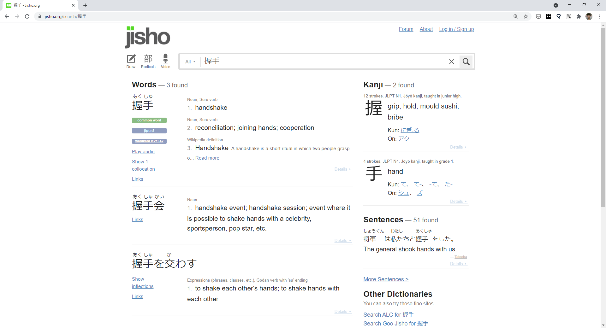
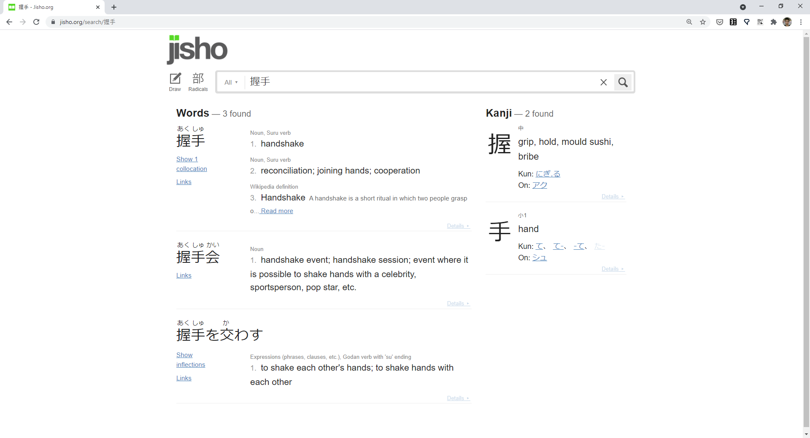
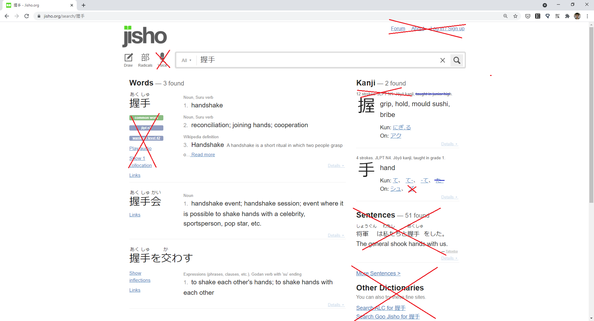

# O que é
Extensão para o Google Chrome para remover do site [Jisho](https://jisho.org/) alguns elementos que servia de distração para o dia-a-dia do meu estudo de japonês.

Antes:

Depois:

Elementos removidos:

Nos **on-yomis** e **kun-yomis** foram removidos as leituras que não faz parte do Jouyou.

# Como usar

1. Extraia o _jisho-minimal.zip_
2. Vá em **chrome://extensions**
3. Habilite o **Developer Mode** no canto superior direito
4. Clique em **Load unpacked**
5. Selecione a pasta extraída _jisho-minimal_
6. Aparecerá o ícone da extensão (letra 'J' num fundo preto).
7. Ao acessar o [Jisho](https://jisho.org/) alguns elementos serão removidos.
